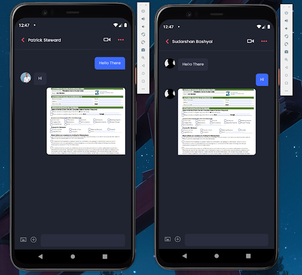
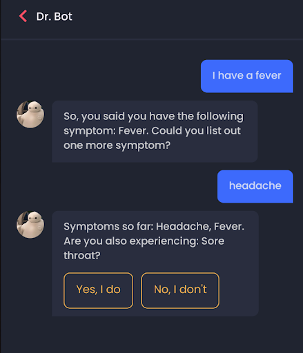

# Remedy

Remedy is a healthcare application made with React-Native, TypeScript, NodeJS, and PostgreSQL. Some of the main features of the application includes:
- Real-time communication with WebSockets and WebRTC
- Timed Reminders with CRON scheduling
- Self-Diagnosis with an interactive chat bot
- Medicine Referencing and Study through the OpenFDA API.

## Tech Stack

A number of different technologies have been utilized to make this application possible. Some of the technologies used are:

| Tech | Usage |
|------|-------|
| [React-Native](https://reactnative.dev/) | Frontend UI library for building mobile application|
| [TypeScript](https://www.typescriptlang.org/) | A superset of TypeScript to introduce strick-typed system to JavaScript |
| [Node](https://nodejs.org/en/) | A JS runtime which can run JS outside of a browser |
| [Express](https://expressjs.com/) | Framework for NodeJS to build RESTful web APIs|
| [PostgreSQL](https://www.postgresql.org/) | Relational DataBase |
| [Prisma](https://www.postgresql.org/) | An ORM made for NodeJS and TypeScript with support for multiple databases |
| [Socket.IO](https://socket.io/) | A library for implementing real time communication using the WebSockets protocol |
| [Voximplant](https://voximplant.com/) | A cloud platform for media-based communication using the WebRTC protocol |
| [Google Cloud Services](https://voximplant.com/) | Used for integrating Maps within the application |
| [MapBox](https://www.mapbox.com/) | Used in conjunction with the Google Cloud Services |

## Functionalities

Some screenshots of the application are attached below:

